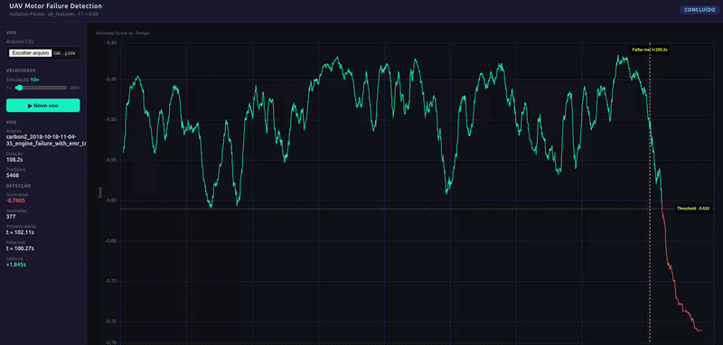

# UAV Motor Failure Detection



---

## Overview

Unsupervised motor failure detection system for fixed-wing UAVs. The model analyzes telemetry data in real time and raises an anomaly alert as soon as flight patterns diverge from normal behavior — no labeled failure examples required for training.

**Best result:** Isolation Forest · all_features · F1 = 0.86 · Detection latency = 0.14 s

---

## Objective

Detect motor failure as early as possible after it occurs, using only onboard sensor data (IMU, magnetometer, GPS, airspeed, throttle, etc.). The model must generalize across different flights and operate with latency compatible with onboard emergency systems.

---

## Dataset

**ALFA — Autonomous aircraft Loss-of-control Flight Analysis**
[https://theairlab.org/alfa-dataset/](https://theairlab.org/alfa-dataset/)

| Attribute | Detail |
|---|---|
| Aircraft | CarbonZ (fixed-wing) |
| Period | July–October 2018 |
| Failure flights | Induced motor failure, with and without emergency recovery trajectory (EMR traj) |
| Normal flights | Reference flights with no failure |
| Format | One CSV per flight in `aeroespacial-2/data/03_primary/` |
| Signal source | ROS topics merged by `merge_asof` in time |

The dataset contains ~30 flights covering different failure scenarios. Each row represents a time instant and each column a sensor channel or derived feature.

> **Setup:** place the original raw CSV files from the ALFA dataset into `aeroespacial-2/data/01_raw/` before running the pipelines.

---

## Environment setup

The project uses [Poetry](https://python-poetry.org/) to manage dependencies. Run all commands from the **repository root** (where `pyproject.toml` lives).

### Prerequisite: install Poetry

```bash
curl -sSL https://install.python-poetry.org | python3 -
```

Verify:

```bash
poetry --version
```

### Install dependencies

```bash
poetry install
```

This creates the virtual environment in `.venv/` and installs the `aeroespacial_2` package in editable mode, making it importable from notebooks and pipelines.

### Activate the environment

```bash
eval $(poetry env activate)
```

Or prefix any command with `poetry run <command>`.

---

## Kedro pipelines

The project has two pipeline tracks, each with its own feature strategy. All commands below are run from the **repository root**.

### Track 1 — All Features (physics-based features)

Full pipeline with features grounded in flight physics (specific energy, altitude, control error, etc.). Documented in `aeroespacial-2/notebooks/all_features/`.

```
data_ingestion → data_preparation → feature_engineering → model_training
```

| Pipeline | Command | What it does |
|---|---|---|
| `data_ingestion` | `kedro run --pipeline=data_ingestion` | Merges all ROS topics from each flight into a single time-aligned DataFrame; filters noise columns |
| `data_preparation` | `kedro run --pipeline=data_preparation` | Renames ROS columns, removes redundant ones, trims the first second, and creates 6 error features (commanded − measured) |
| `feature_engineering` | `kedro run --pipeline=feature_engineering` | Computes physics-based features: total specific energy, altitude variation, and rolling statistics over all signals |
| `model_training` | `kedro run --pipeline=model_training` | Feature selection, Isolation Forest training, and per-flight evaluation; artifacts saved to `data/06_models/` |

To run the full track at once:

```bash
kedro run
```

### Track 2 — FFT Features (spectral features)

Alternative pipeline with spectral features over the 7 signals with a direct physical link to motor rotation frequency (IMU, magnetometer, airspeed). Documented in `aeroespacial-2/notebooks/fft_features/`.

```
fft_ingestion → fft_data_preparation → fft_feature_engineering → fft_model_training
```

| Pipeline | Command | What it does |
|---|---|---|
| `fft_ingestion` | `kedro run --pipeline=fft_ingestion` | Loads only signals with motor-linked periodicity |
| `fft_data_preparation` | `kedro run --pipeline=fft_data_preparation` | Same flow as Track 1, restricted to the FFT subset |
| `fft_feature_engineering` | `kedro run --pipeline=fft_feature_engineering` | Spectral (FFT) and rolling features over the 7 motor signals |
| `fft_model_training` | `kedro run --pipeline=fft_model_training` | Isolation Forest training and evaluation over spectral features |

### Visualize the pipeline graph

```bash
kedro viz
```

### Run the notebooks

```bash
poetry run jupyter lab
```

Notebooks are in `aeroespacial-2/notebooks/` and have access to the `aeroespacial_2` package after `poetry install`. Each notebook documents one pipeline stage with step-by-step examples and visualizations.

---

## Deploy

The real-time inference API lives in `aeroespacial-2/deploy/`. See the [deploy README](aeroespacial-2/deploy/README.md) for instructions on running the local server and the Docker container.

---

## Structure

```
.
├── pyproject.toml                  # dependencies and Kedro configuration
├── aeroespacial-2/
│   ├── conf/                       # Kedro parameters and catalog
│   ├── data/
│   │   ├── 01_raw/                 # ← place ALFA raw CSV files here
│   │   ├── 03_primary/             # prepared flights (all features)
│   │   ├── 04_feature/             # engineered features (all features)
│   │   ├── 03_primary_fft/         # prepared flights (FFT)
│   │   ├── 04_feature_fft/         # engineered features (FFT)
│   │   ├── 06_models/              # trained models and scalers
│   │   └── 07_model_output/        # evaluation metrics
│   ├── notebooks/
│   │   ├── all_features/           # exploration and docs for Track 1
│   │   └── fft_features/           # exploration and docs for Track 2
│   ├── src/aeroespacial_2/         # Kedro pipeline code
│   └── deploy/                     # FastAPI + web interface
└── assets/
    └── demo.gif                    # real-time detection demo
```
